# AWS
## 아키텍팅 기본사항

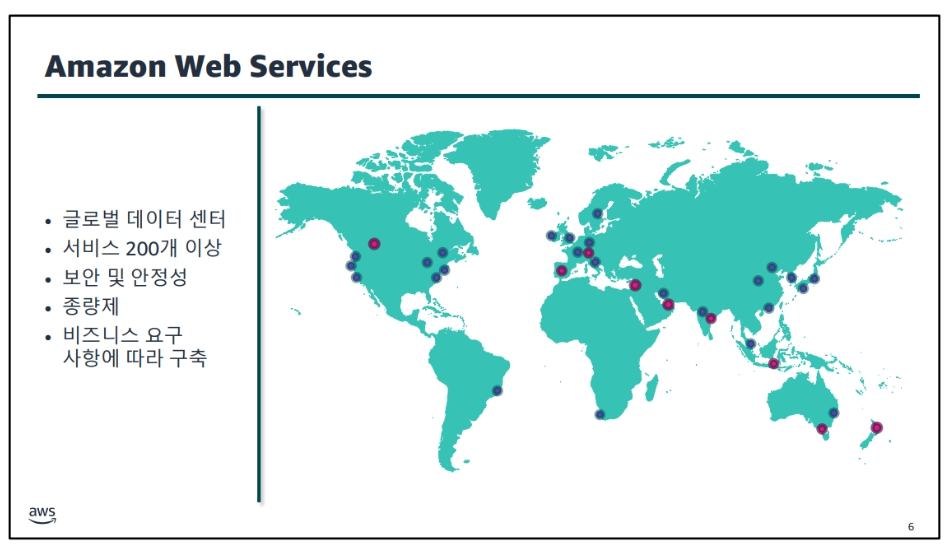

AWS? 
 - Amazon Web Services는 아마존(Amazon)에서 제공하는 **클라우드 서비스**로, 네트워킹을 기반으로 가상 컴퓨터와 스토리지, 네트워크 인프라 등 다양한 서비스를 제공하고 있다.

- 클라우드 컴퓨팅(Cloud computing)?
인터넷을통해 IT 리소스와 애플리케이션을 온디맨드로 제공하는서비스, 종량 과금제

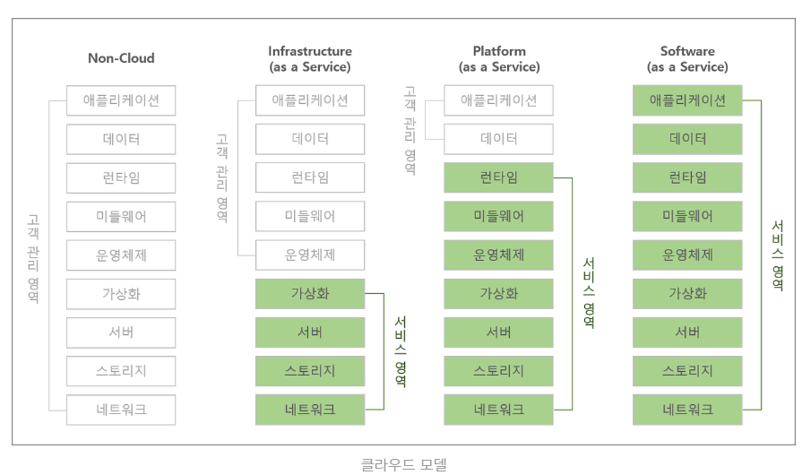

 - 기존의 물리적인 형태의 실물 컴퓨팅 리소스를 네트워크 기반 서비스 형태로 제공하는 것.
 - 사용자로 하여금 네트워크 상에서 클라우드 서비스의 자원을 사용하는 것을 의미한다.
 - 위와 같이 3가지 분류로 나누기도 한다.
 - AWS는 일반적으로 IASS에 포함된다고 하고 몇몇서비스들이 PASS에 포함이된다고 한다.

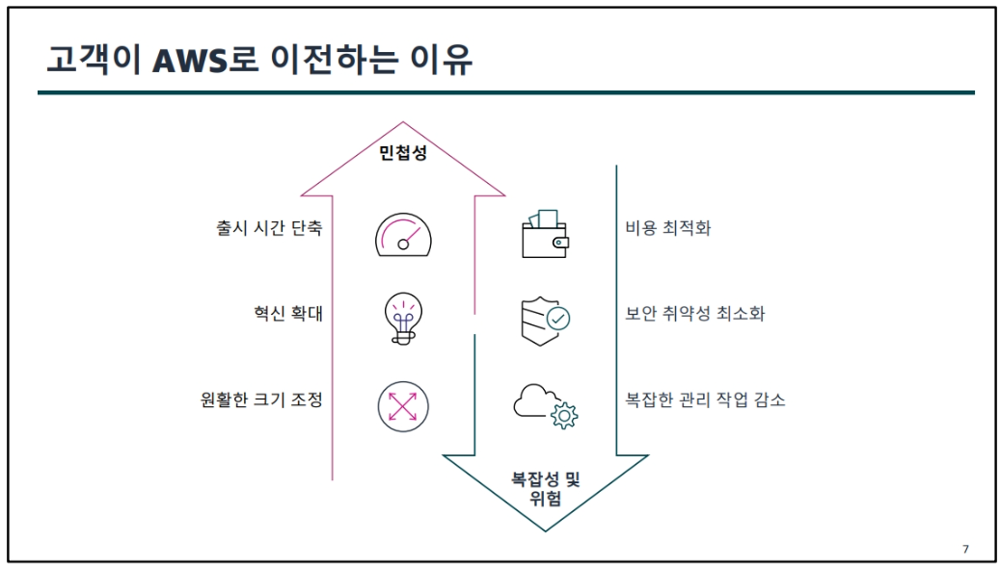
- **출시 시간 단축** – 인프라확보및  관리시간이 단축되므로 고객에게 가치를 제공하는 기능개발에 주력할수있습니다.
- **더욱 광범위한 혁신추진** – AWS를활용하면 디지털트랜스포메이션을 더욱 신속하게 추진할 수 있습니다. 최신기술과 모범사례를 더욱 손쉽게 활용할 수있는 도구가 제공되기 때문입니다. 예를 들어 AWS를 사용하면 자동화기능 개발, 컨테이너화채택, 기계학습사용 등 이가능해집니다.
- **원활한 크기 조정** – 추가 리소스를 프로비저닝하여 새로운기능을 지원하고 수요에 따라 기존리소스를 확장또는축소 할 수 있습니다.
복잡한 작업과위험을 줄이기 위해 AWS로 이전하는고객도있습니다.
- **비용 최적화** – AWS에서는 리소스 사용량만큼만 요금을 지불하면 되므로 비용을 줄일 수 있습니다. 즉, 용량을 한도까지 사용하지 않을 수 도 있는 온프레미스 하드웨어비용을 지출하는 대신 컴퓨팅리소스 사용시간만큼만 요금을 지불하면됩니다.
- **보안 취약성 최소화** – AWS로 이전하면 애플리케이션과 데이터가AWS 데이터 센터의 고급물리적 보안기능을 통해 보호됩니다. AWS에서는 다양한도구를 통해 리소스 액세스를 관리 할 수 있습니다.
- **복잡한 관리 작업감소** – AWS 서비스사용시에는물리적데이터센터유지 관리, 하드웨어유지관리, 물리적 데이터 센터 유지 관리, 하드웨어 유지관리, 물리적 인프라 관리 작업의 필요성을 줄일 수 있습니다.
--------------------------------------
- **원활한크기조정(유연성과 확장성)** -
사용자들이 필요한 리소스를 필요한 만큼 늘리거나 줄일 수 있도록 유연성과 확장성을 제공한다. 이를 통해 사용자는 트래픽이나 수요 증가에 대응할 수 있으며, 필요하지 않은 리소스는 낭비하지 않을 수 있다. -> ELB(Elastic Load Balancing) , Auto Scailing
--------------------------------------

학습목표 : AWS 기본서비스 환경 구축에 대한 이해 및 구축 방법

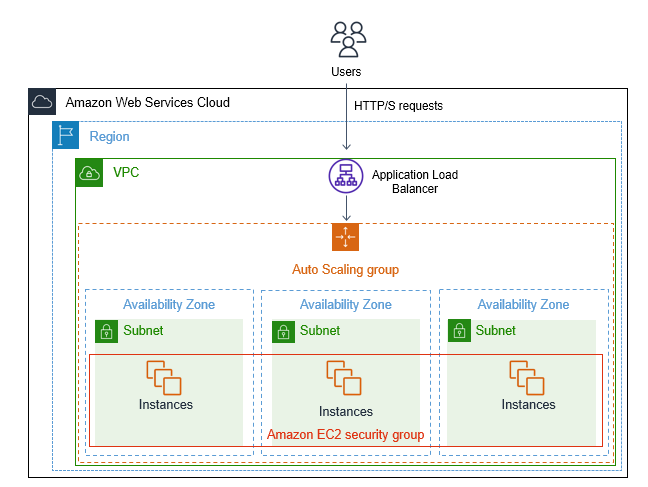

- Region
- VPC
- ELB(Application Load Balancer)
- Auto Scaling Group
- Availability Zone(가용영역)
- 서브넷
- Instances(EC2)
 

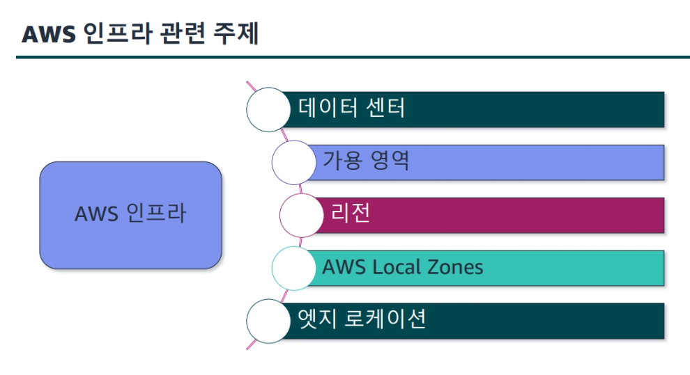

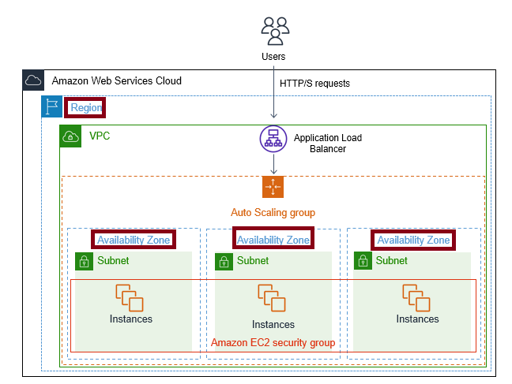
- 파란색 글자에 해당되는 설명

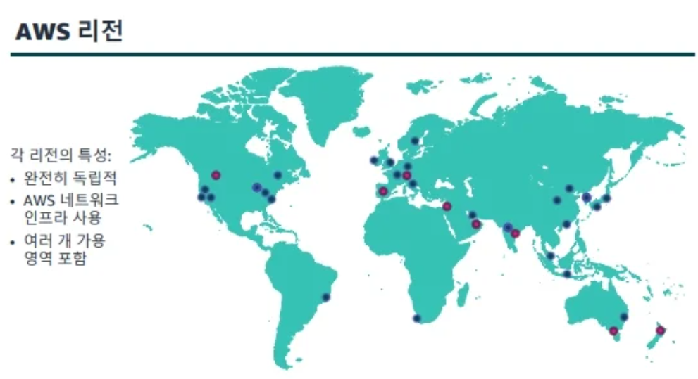
- 리전? 지리적 위치
- 아마존 웹 서비스들의 서버가 어디에 위치 하는가?
 내가 서비스 하려는 지역의 주 고객들이 거주하는 지역과 서버의 거리가 멀면 멀수록 느려진다.
- 리전에 따른 가격차이도 있음 (전력수급이 원할하지 않다던가)

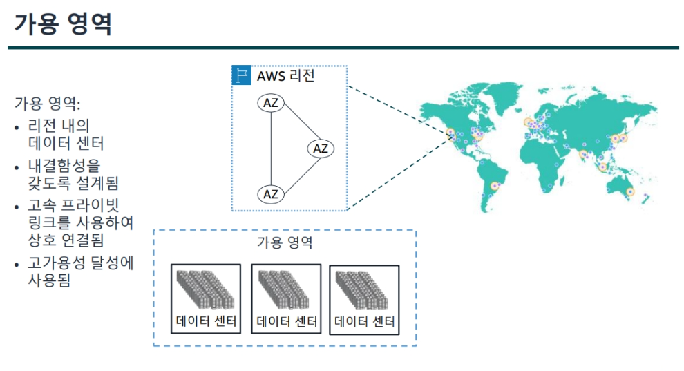

- 데이터센터 < 가용영액 < 리전 순으로 구성
- 하나이상의 데이터센터를 가용그룹이라고 합니다.
- 가용 영역(이하 AZ)이란 각 리전 내에 격리된 위치.
개별 데이터센터로 구성되어 있음.
즉 리전이 동일해도 다른 가용 영역에 AWS 서비스를 각각 배치했다면 물리적으로 격리된 복수의 데이터센터를 사용하는 것.

물리적 격리란?
자연재해 및 정전 등 사고에 자유롭다는 의미.

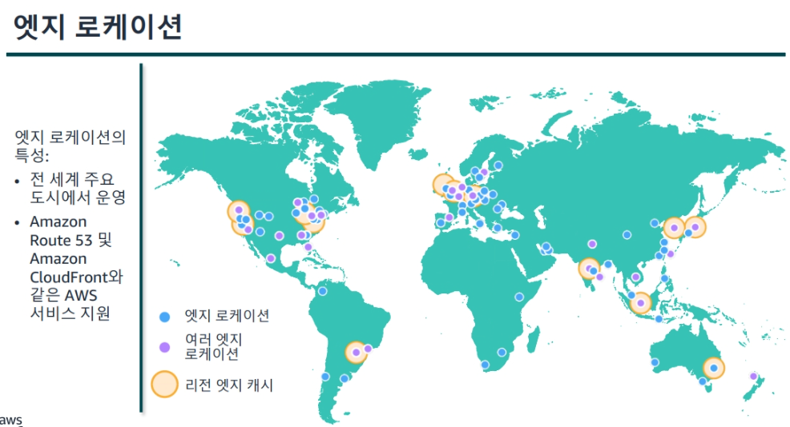

- 엣지 로케이션(Edge Location)이란, Amazon의 CDN 서비스인 CloudFront를 위한 캐시 서버(Cache Server)들의 모음

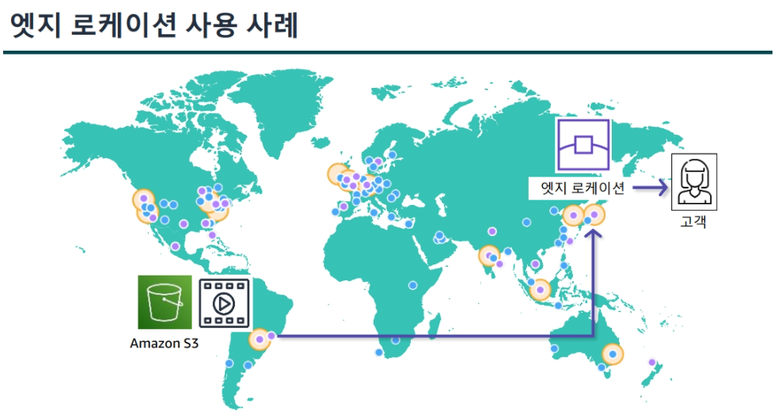

- 남아메리카의 Amazon Simple Storage Service(Amazon S3)에 저장된 비디오 파일의 예가 표시 되어있습니다. 이 비디오 파일은 아시아의 고객에게 빠르게 제공됩니다. 파일이 고객과 가까운 엣지로케이션에 캐시

## 계정 보안

IAM이란?
https://docs.aws.amazon.com/ko_kr/IAM/latest/UserGuide/introduction.html

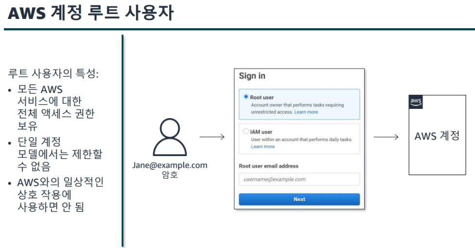
- AWS 계정을 처음생성 할 때는 **루트사용자**로 시작합니다. 
이 사용자는 계정의 모든AWS 서비스 및 리소스에 대한 전체 액세스 권한을 가집니다. 

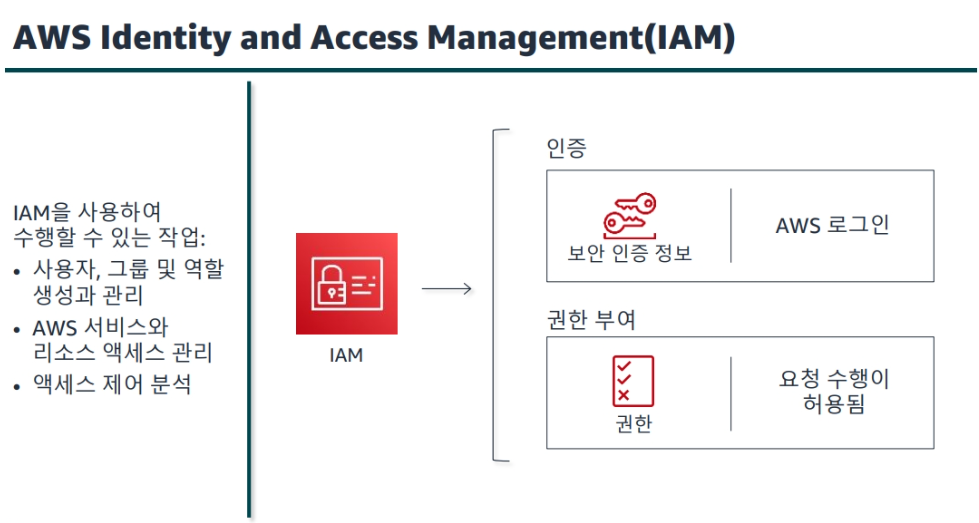

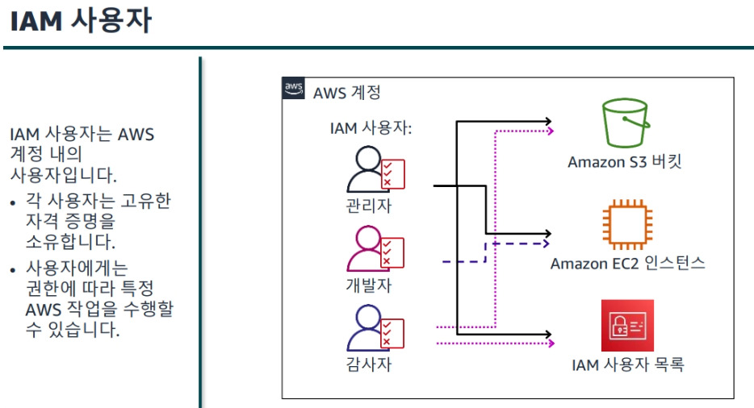

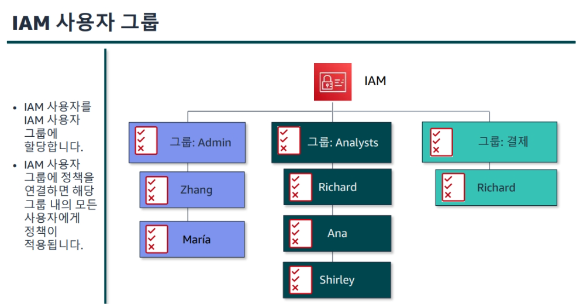

- https://ukayzm.github.io/aws-create-iam-user/ (I AM 사용법)

### VPC의 기초
 - 참조 : https://docs.aws.amazon.com/ko_kr/vpc/latest/userguide/what-is-amazon-vpc.html (VPC)

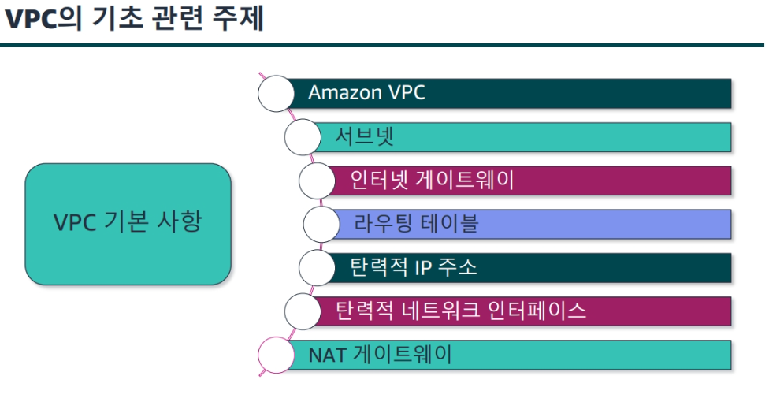
- VPC의 목적은 다양할 수 있지만 일반적으로 보안을위해 AWS 리소스간 허용을 최소화하고 그룹별로 손쉽게 네트워크를 구성하기위해 많이사용합니다

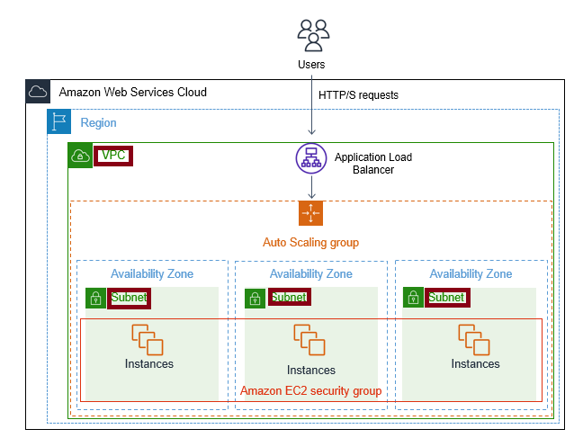

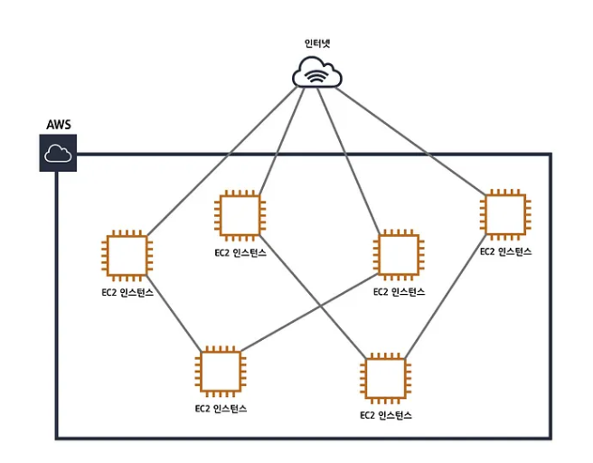

- VPC가 없는구조

VPC가 없다면 EC2 인스턴스들이 서로 거미줄처럼 연결되고 인터넷과 연결됩니다. 이런 구조는 시스템의 복잡도를 엄청나게 끌어올릴뿐만 아니라 하나의 인스턴스만 추가되도 모든 인스턴스를 수정해야하는 불편함이 생깁니다. 마치 인터넷 전용선을 다시까는것과 같습니다.

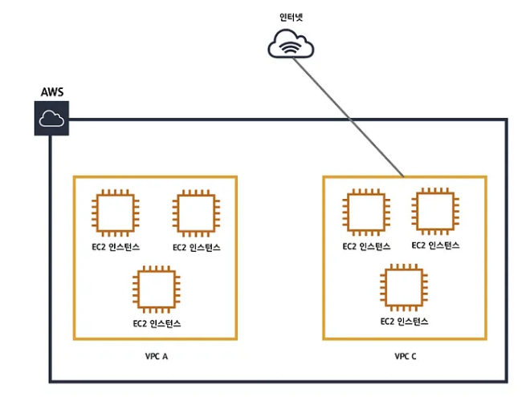
- VPC가 적용된 구조

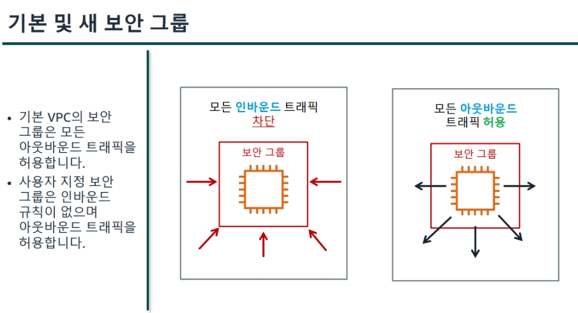

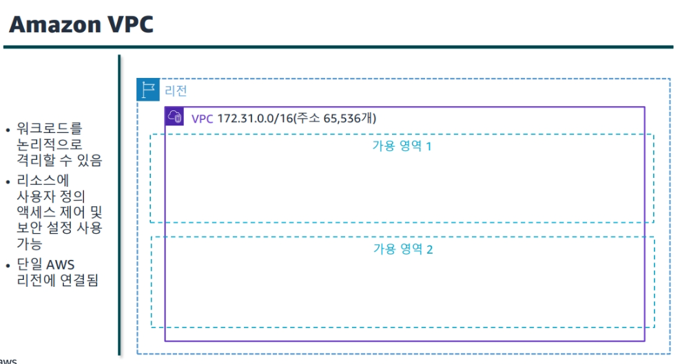
VPC를 만들었다면 이제 서브넷을 만들 수 있습니다. 서브넷은 VPC를 잘개 쪼개는 과정입니다. 서브넷은 VPC안에 있는 VPC보다 더 작은단위이기때문에 연히 서브넷마스크가 더 높게되고 아이피범위가 더 작은값을 갖게됩니다. 서브넷을 나누는 이유는 더 많은 네트워크망을 만들기 위해서입니다.

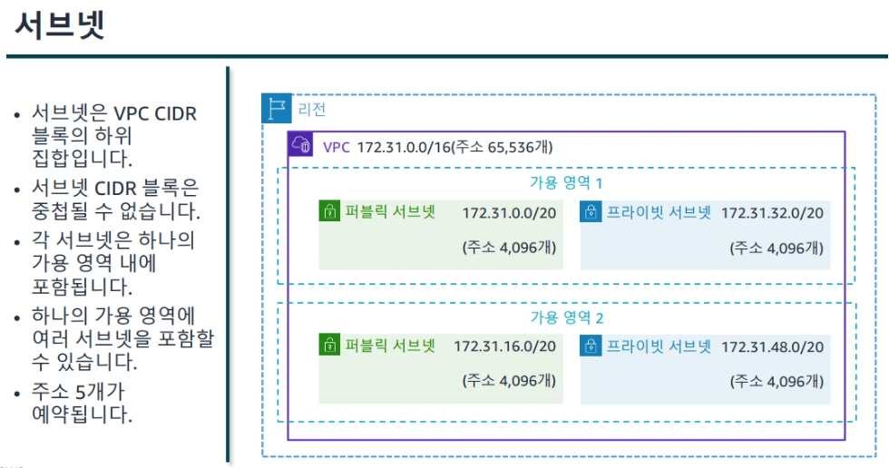
각각의 서브넷은 가용영역안에 존재하며 서브넷안에 RDS, EC2와같은 리소스들을 위치시킬 수 있습니다.

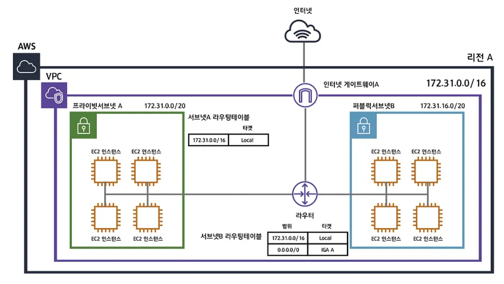
인터넷게이트웨이는 VPC와 인터넷을 연결해주는 하나의 관문입니다. 서브넷B의 라우팅테이블을 잘보면 0.0.0.0/0으로 정의되어있습니다. 이뜻은 모든 트래픽에 대하여 IGA(인터넷 게이트웨이) A로 향하라는뜻입니다. 라우팅테이블은 가장 먼저 목적지의 주소가 172.31.0.0/16에 매칭되는지를 확인한 후 매칭되지 않는다면 IGA A로 보냅니다.

https://medium.com/harrythegreat/aws-%EA%B0%80%EC%9E%A5%EC%89%BD%EA%B2%8C-vpc-%EA%B0%9C%EB%85%90%EC%9E%A1%EA%B8%B0-71eef95a7098

https://kimjingo.tistory.com/175

## 인스턴스(EC2)

독립된 컴퓨터를 임대해주는 서비스 (AWS의 대표적인 서비스, 대표적인 상품)
1. 특징
 - 컴퓨팅 요구사항의 변화에 따라 컴퓨팅 파워를 조정할 수 있다.
 - 새로운 서버 인스턴스 확보 및 부팅시간을 몇분으로 단축시킬 수 있다.
 - 실제로 사용한 용량만큼만 지불 가능 (요금제 선택에 따라 낭비할 수 도 있음)
 - Linux / Windows 중 선택 가능하다 (이외 운영체제는 현재 지원하지 않는다)
 - 안정성을 위해 여러 AWS 리전과 가용 영역에 걸쳐 배포.

리전 선택

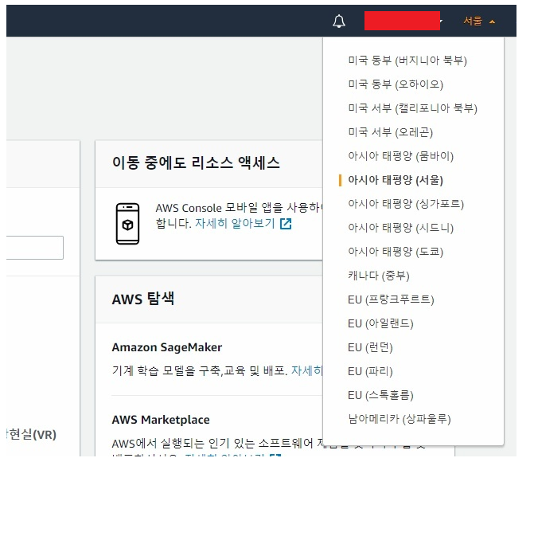
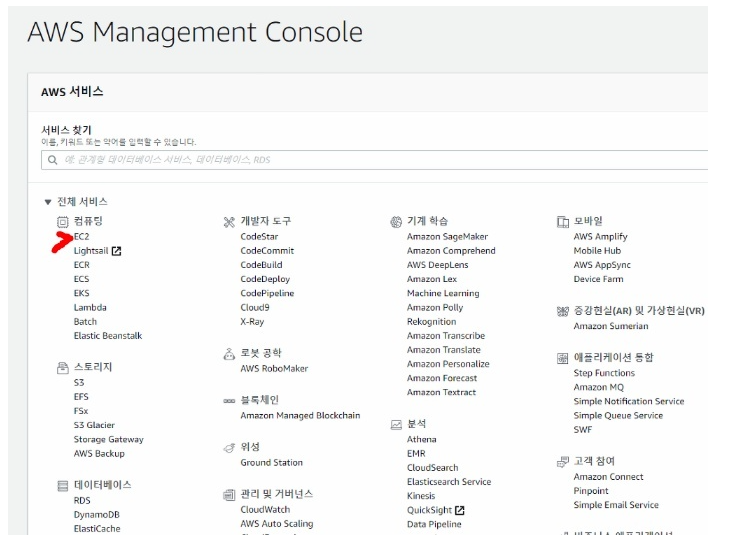
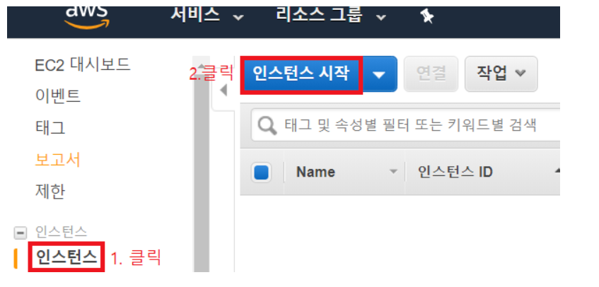

## Amazon Machine Image(AMI) 선택
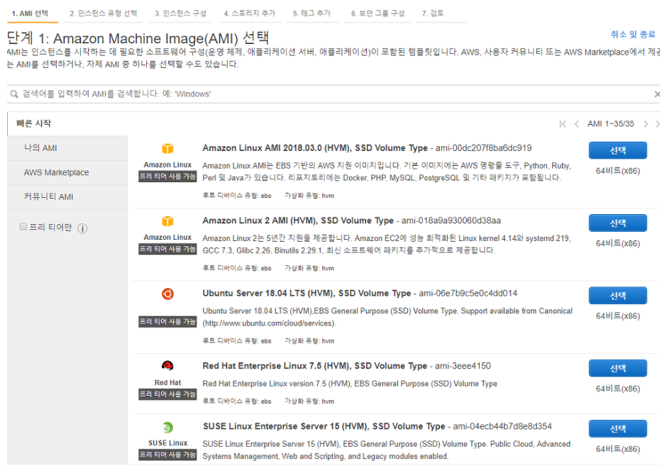
 - Amazon Machine Image(AMI) 선택 이라고 하는 것은 운영체제를 선택한다고 보면 된다.
   (AMI : 사전 구성된 Amazon 머신이미지 라고 볼 수 있다.)
 - Linux / Windows 중에서 선택 가능하다.
   (직접 리눅스를 커스터 마이징 하여 아마존 웹서비스에 최적화한 Amazon Linux를 제공한다.)

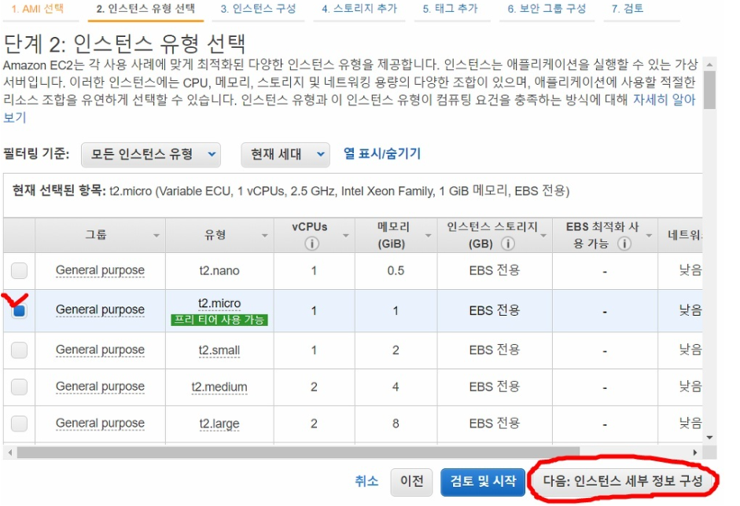
 - [프리 티어 사용 가능] 이 붙지 않은 Instance는 컴퓨터를 시작하는 순간부터 과금이 발생할 수 있다.

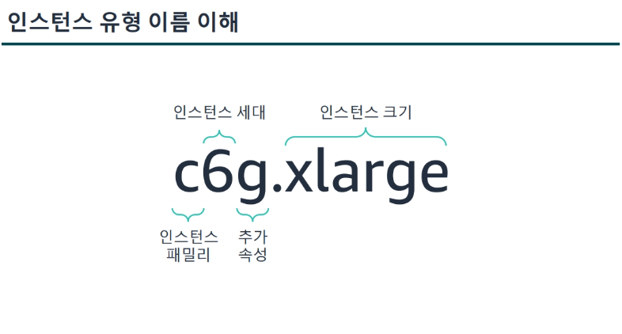

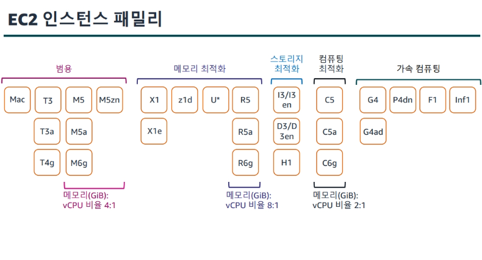

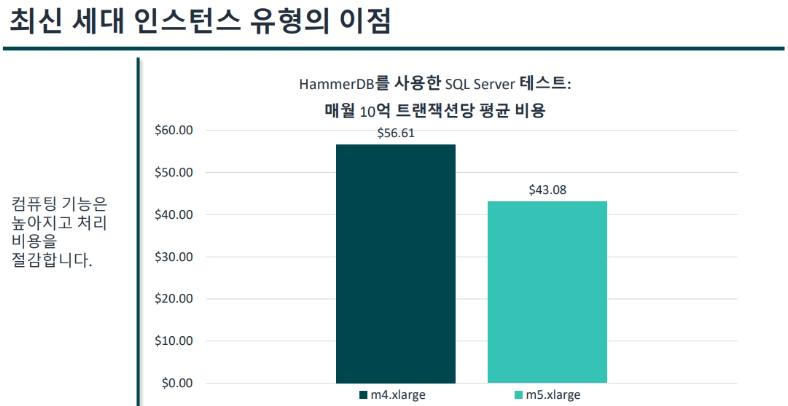

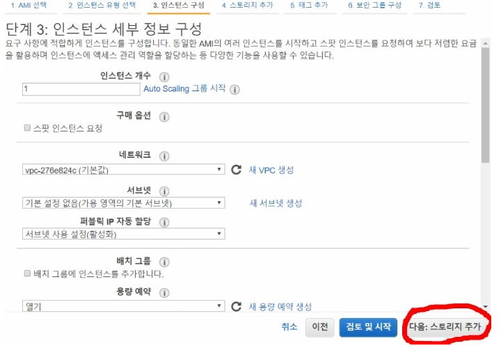

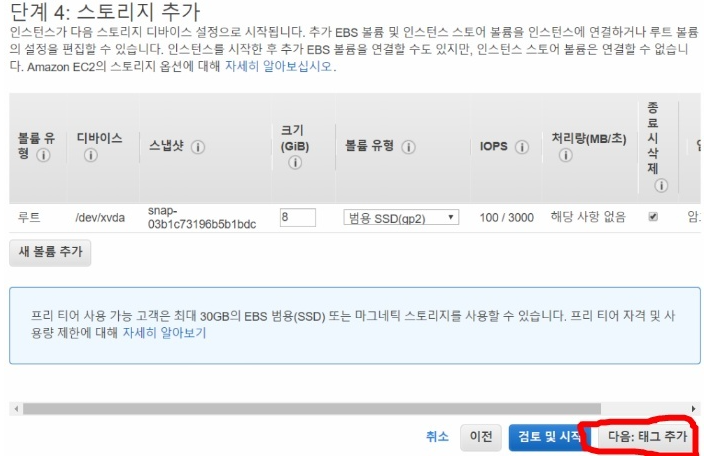

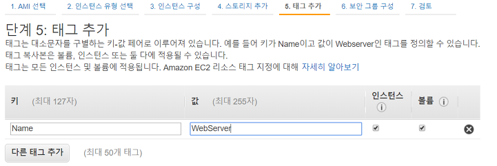

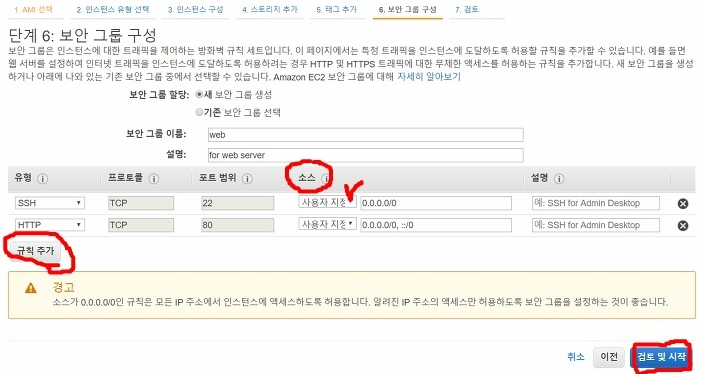

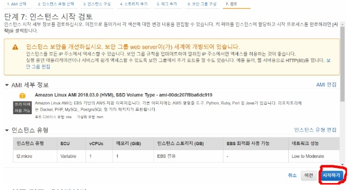

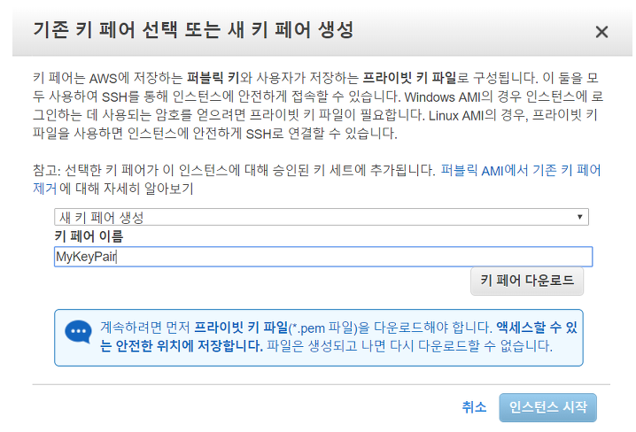

※ 키페어를 어디에 저장하는가?
AWS 자습서에서는 다음 위치에 저장 할 것을 권고, 가이드 하고 있다.

(참고 https://aws.amazon.com/ko/getting-started/tutorials/launch-a-virtual-machine/)

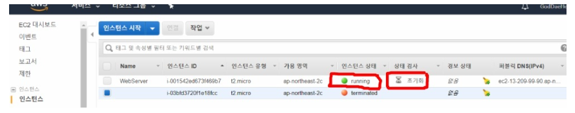

## S3
S3는 AWS(Amazon Web Service)에서 제공하는 인터넷 스토리지 서비스입니다.
S3(Simple Storage Service) 를 뜻합니다. -> 저장 공간 

### 사용이유
- S3는 저장 용량이 무한대이고 파일 저장에 최적화되어 있다. 용량을 추가하거나 성능을 높이는 작업이 필요없다.
- 비용은 EC2와 EBS로 구축하는 것보다 훨씬 저렴
- S3 자체가 수천 대 이상의 매우 성능이 좋은 웹 서버로 구성되어 있어서 EC2와 EBS로 구축했을 때 처럼 Auto Scaling이나 Load Balancing에 신경쓰지 않아도 된다.
- 동적 웹페이지와 정적 웹페이지가 섞여있을 때 동적 웹페이지만 EC2에서 서비스하고 - 정적 웹페이지는 S3를 이용하면 성능도 높이고 비용도 절감.
- 웹하드 서비스와 비슷하지만, 별도의 클라이언트 설치나 ActiveX를 통하지 않고 HTTP 프로토콜로 파일 업로드/다운로드 처리
- S3 자체로 정적 웹서비스 가능

https://celdan.tistory.com/40 EC2와 S3 연동과정

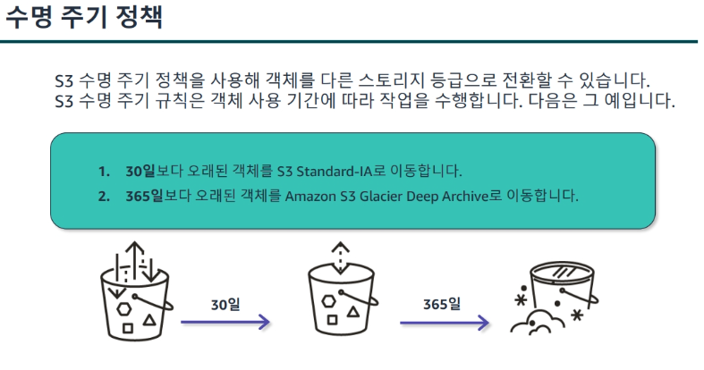

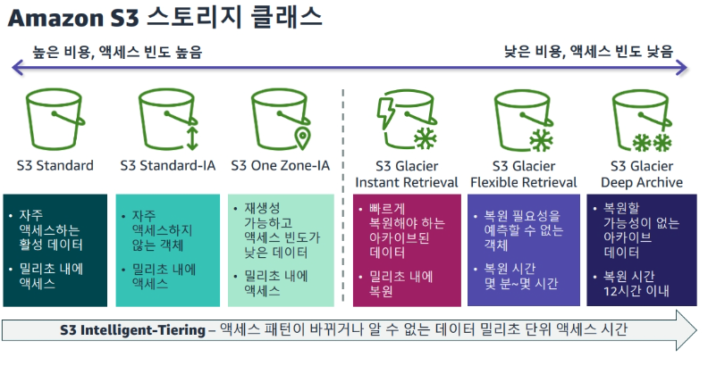

## ELB, Auto Scailing

https://daeunnniii.tistory.com/142 ELB와 AutoScailing 적용과정 

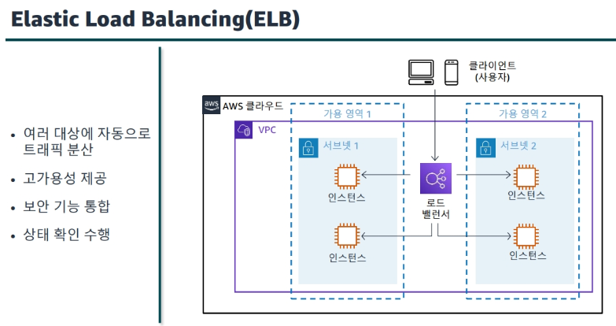

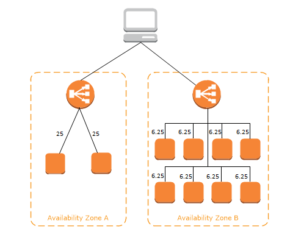

<분산이 불균형한 상태>

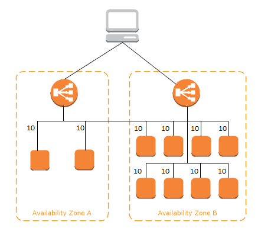

<로드밸런싱이 적용된 상태>

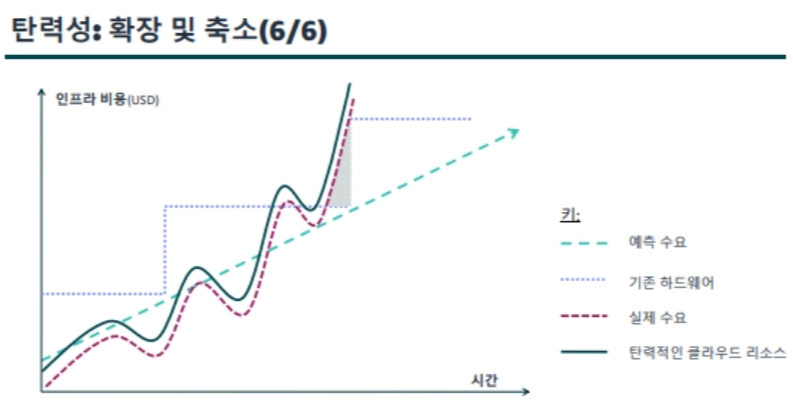
- 수요량증가 예측에 따른 하드웨어 증설로 인한 비용보다
- 실제 사용량의 지속적인 증가 혹은 일시적인 요청증가가 예상이 될 경우 그에 따라 유연한 서버증가가 비용절감에 많은 도움이 된다.

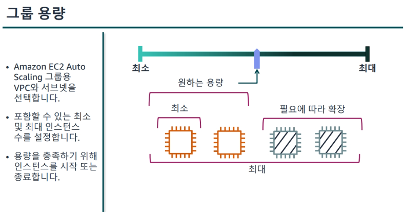

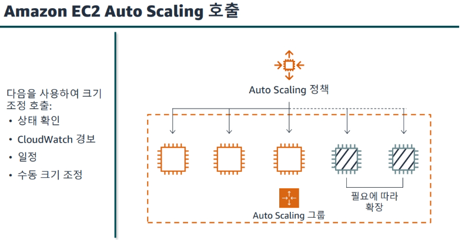

## 기타 RDS 등

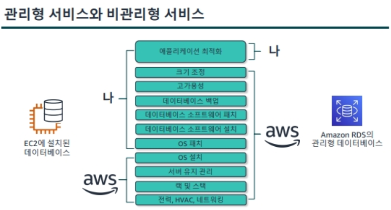

## 마무리
