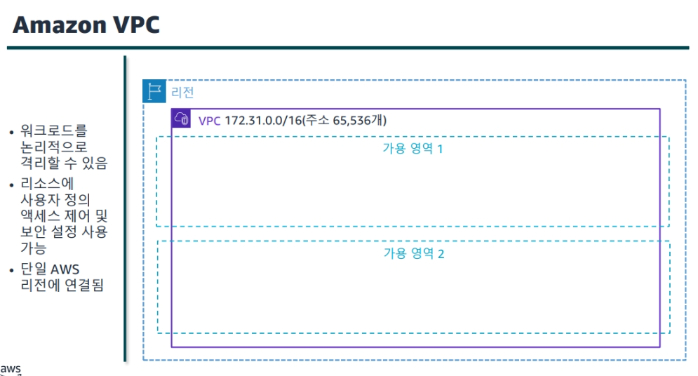

# AWS
## 아키텍팅 기본사항

AWS? 
 - Amazon Web Services는 아마존(Amazon)에서 제공하는 클라우드 서비스로, 네트워킹을 기반으로 가상 컴퓨터와 스토리지, 네트워크 인프라 등 다양한 서비스를 제공하고 있다.

클라우드 컴퓨팅(Cloud computing)?
[ 인터넷을통해 IT 리소스와 애플리케이션을 온디맨드로 제공하는서비스, 종량 과금제 ]

 - 기존의 물리적인 형태의 실물 컴퓨팅 리소스를 네트워크 기반 서비스 형태로 제공하는 것.
 - 사용자로 하여금 네트워크 상에서 클라우드 서비스의 자원을 사용하는 것을 의미한다.
 - 위와 같이 3가지 분류로 나누기도 한다.

- **출시시간단축** – 인프라확보및  관리시간이 단축되므로 고객에게 가치를 제공하는 기능개발에 주력할수있습니다.
- **더욱광범위한혁신추진** – AWS를활용하면 디지털트랜스포메이션을 더욱 신속하게 추진할 수 있습니다. 최신기술과 모범사례를 더욱 손쉽게 활용할 수있는 도구가 제공되기 때문입니다. 예를 들어 AWS를 사용하면 자동화기능 개발, 컨테이너화채택, 기계학습사용 등 이가능해집니다.
- **원활한크기조정** – 추가 리소스를 프로비저닝하여 새로운기능을 지원하고 수요에 따라 기존리소스를 확장또는축소 할 수 있습니다.
복잡한 작업과위험을 줄이기 위해 AWS로 이전하는고객도있습니다.
- **비용최적화** – AWS에서는 리소스 사용량만큼만 요금을 지불하면 되므로 비용을 줄일 수 있습니다. 즉, 용량을 한도까지 사용하지 않을 수 도 있는 온프레미스 하드웨어비용을 지출하는 대신 컴퓨팅리소스 사용시간만큼만 요금을 지불하면됩니다.
- **보안취약성최소화** – AWS로 이전하면 애플리케이션과 데이터가AWS 데이터 센터의 고급물리적 보안기능을 통해 보호됩니다. AWS에서는 다양한도구를 통해 리소스 액세스를 관리 할 수 있습니다.
- **복잡한관리작업감소** – AWS 서비스사용시에는물리적데이터센터유지 관리, 하드웨어유지관리, 물리적 데이터 센터 유지 관리, 하드웨어 유지관리, 물리적 인프라 관리 작업의 필요성을 줄일 수 있습니다.
--------------------------------------
- **원활한크기조정(유연성과 확장성)** -
사용자들이 필요한 리소스를 필요한 만큼 늘리거나 줄일 수 있도록 유연성과 확장성을 제공한다. 이를 통해 사용자는 트래픽이나 수요 증가에 대응할 수 있으며, 필요하지 않은 리소스는 낭비하지 않을 수 있다. -> ELB(Elastic Load Balancing) , Auto Scailing
--------------------------------------

- 하나이상의 데이터센터를 가용그룹이라고 합니다.
- 가용 영역(이하 AZ)이란 각 리전 내에 격리된 위치.
개별 데이터센터로 구성되어 있음.
즉 리전이 동일해도 다른 가용 영역에 AWS 서비스를 각각 배치했다면 물리적으로는 복수의 데이터센터를 사용하는 것.
 
AWS 한 개의 데이터 센터에는 50,000~80,000대의 물리적 서버가 있다고 한다.
각각의 AZ들은 고속 프라이빗 네트워크로 연결되어 있다.
동일 리전 내 존재하는 복수의 AZ는 서로 물리적으로 격리되어 있지만, 좋은 품질의 네트워크 연결을 통해 논리적으로 연결되어 있다.

물리적 격리란?
자연재해 및 정전 등 사고에 자유롭다는 의미.

기존 Region 개념을 논리적으로 확장하여 특정 지역에 있는 고객들에게 10밀리초 미만의 초저지연 서비스를 제공하기 위하여 도입한 개념이다. 기존 AWS 서비스들을 제공되는 Local Zone 에서 사용함으로써 이에 따른 초고속 데이터 통신등의 여러 장점을 활용 할 수 있다. 또한 기본 Region 에서 AWS 서비스들을 사용하는 비용과 다르게 산출 된다.
코드는 Region 코드 사이에 lax 식별자를 붙인다. (예 : us-west-2-lax-1a)

--------------------------------------

현재 Amazon RDS를 사용할 수 있는 AWS 로컬 영역은 미국 서부(오레곤) 리전의로스앤젤레스뿐입니다.

--------------------------------------

- 엣지 로케이션(Edge Location)이란, Amazon의 CDN 서비스인 CloudFront를 위한 캐시 서버(Cache Server)들의 모음

- 남아메리카의Amazon Simple Storage Service(Amazon S3)에 저장된비디오파일의예가표시되어있습니다. 이비디오파일은아시아의 고객에게빠르게제공됩니다. 파일이고객과가까운엣지로케이션에캐시

## 계정 보안

IAM이란 무엇입니까?
https://docs.aws.amazon.com/ko_kr/IAM/latest/UserGuide/introduction.html

- AWS 계정을 처음생성 할 때는 **루트사용자**로 시작합니다. 
이 사용자는 계정의 모든AWS 서비스 및 리소스에 대한 전체 액세스 권한을 가집니다. 계정을 생성할 때 제공한 이메일 주소와 암호로 로그인하여 루트사용자 ID에액세스합니다. AWS와의 일상적인 상호작용에는 루트계정 보안인증정보를 사용하지 않아야 합니다. 일상태스크를 위한 사용자를 생성하십시오. 비교적 쉽게 사용자를 관리하고 감시할 수있습니다.

IAM은 AWS 리소스에 대한 액세스를 안전하게 제어하는데 도움이 되는 웹 서비스입니다. IAM을 사용하여 리소스를 사용하도록인증(로그인) 및 권한 부여(권한있음)된 대상을 제어합니다.
IAM을 리소스실행, 구성, 관리, 종료를 위한 액세스 권한을 중앙에서 관리하기 위한 도구로 생각하면됩니다. IAM을 통해 액세스권한을 세부적으로 제어할수 있습니다. 이 제어는 리소스를 기반으로하며 누가 어떤API 호출에 대한 권한이 있는지 정의하는데 도움이됩니다.
보안정책을 생성 및 사용하여 AWS에서 액세스를 관리 할 수 있습니다. 이 섹션에서IAM 사용자, IAM 사용자 그룹 및 역할에 대해 알아봅니다.

- https://ukayzm.github.io/aws-create-iam-user/ (I AM 사용법)

### VPC의 기초
 - https://docs.aws.amazon.com/ko_kr/vpc/latest/userguide/what-is-amazon-vpc.html (VPC)

- VPC가 없는구조

VPC가 없다면 EC2 인스턴스들이 서로 거미줄처럼 연결되고 인터넷과 연결됩니다. 이런 구조는 시스템의 복잡도를 엄청나게 끌어올릴뿐만 아니라 하나의 인스턴스만 추가되도 모든 인스턴스를 수정해야하는 불편함이 생깁니다. 마치 인터넷 전용선을 다시까는것과 같습니다.

- VPC가 적용된 구조

https://medium.com/harrythegreat/aws-%EA%B0%80%EC%9E%A5%EC%89%BD%EA%B2%8C-vpc-%EA%B0%9C%EB%85%90%EC%9E%A1%EA%B8%B0-71eef95a7098

https://kimjingo.tistory.com/175

VPC를 만들었다면 이제 서브넷을 만들 수 있습니다. 서브넷은 VPC를 잘개 쪼개는 과정입니다. 서브넷은 VPC안에 있는 VPC보다 더 작은단위이기때문에 연히 서브넷마스크가 더 높게되고 아이피범위가 더 작은값을 갖게됩니다. 서브넷을 나누는 이유는 더 많은 네트워크망을 만들기 위해서입니다.

각각의 서브넷은 가용영역안에 존재하며 서브넷안에 RDS, EC2와같은 리소스들을 위치시킬 수 있습니다.

## 인스턴스(EC2)

https://goddaehee.tistory.com/179

